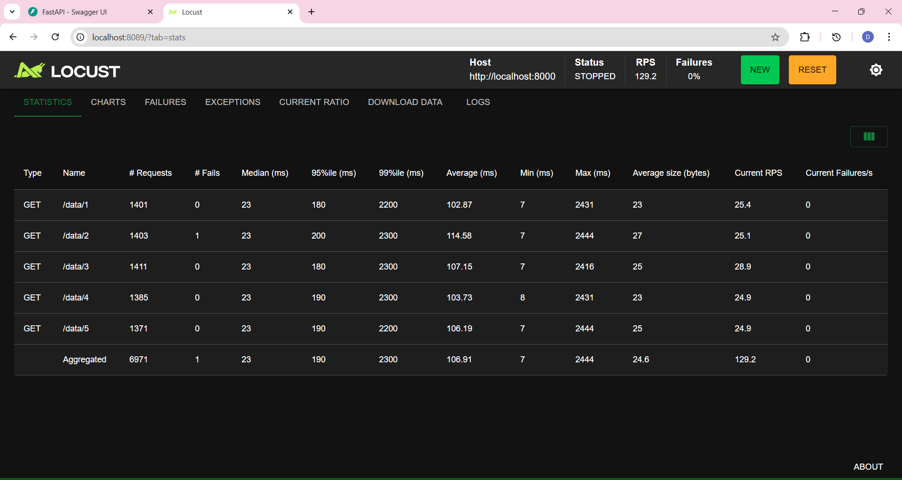

# LRU Cache API


A backend system that explores how introducing a caching layer can improve API performance and reduce database load in high-traffic environments.

The project implements a custom **in-memory Least Recently Used (LRU) cache** integrated with a **FastAPI REST API** and **PostgreSQL database**. System performance and reliability are evaluated through **benchmarking and concurrent load testing**.

This project demonstrates practical backend engineering concepts including caching strategies, service-layer design, observability, and concurrency handling.

---

# Architecture

```

Client
↓
FastAPI API
↓
CacheService
↓
LRU Cache
↓
PostgreSQL

```

### Request Flow

1. Client sends a request to the API
2. API calls the CacheService
3. CacheService checks if the key exists in the cache
4. If cache hit → return cached value
5. If cache miss → query database
6. Store the result in cache
7. Return response to client

---

# Key Features

• Custom LRU cache implementation (HashMap + Doubly Linked List)  
• O(1) cache get and put operations  
• FastAPI REST API for data access  
• PostgreSQL backend storage  
• Load testing using Locust  
• Benchmarking cache vs database performance  
• Logging and cache metrics for observability

---

# Project Goals

• Implement a custom LRU cache using a hashmap and doubly linked list  
• Integrate the cache with a REST API and database layer  
• Measure performance improvements using benchmarking  
• Simulate concurrent traffic using load testing  
• Identify and resolve concurrency issues in shared-memory caching

---

# Tech Stack

- Python
- FastAPI
- PostgreSQL
- Locust (Load Testing)

---

# Project Structure

```

lru_cache_api
│
├── api
│ └── server.py # FastAPI server and API endpoints
│
├── cache
│ ├── lru_cache.py # Core LRU cache implementation
│ ├── node.py # Doubly linked list node for LRU
│ └── cache_service.py # Service layer managing cache + DB
│
├── database
│ ├── db.py # Database interface / abstraction
│ └── postgres.py # PostgreSQL implementation
│
├── benchmark
│ ├── load_test.py # Simple performance benchmark
│ └── locustfile.py # Locust load testing configuration
│
├── core
│ └── logging.py # Centralized logging configuration
│
└── requirements.txt # Project dependencies

```

---

## Service Layer

The `CacheService` manages interaction between the API, cache, and database.

```

Request
↓
Check Cache
↓
Cache Hit → Return cached value
Cache Miss → Query DB → Store in cache → Return value

```

This separation keeps the **API layer independent from caching logic**.

---

# API Endpoints

## Get Data

```

GET /data/{key}

```

Example request:

```

GET /data/1

```

Example response:

```

{
  "key": 1,
  "value": "Deo"
}

```

---

## Cache Metrics

```

GET /metrics

```

Returns cache statistics.

Example response:

```

{
  "hits": 7,
  "misses": 1,
  "hit_rate": 0.875
}

```


---

# Logging

The system uses Python's logging module to track runtime behavior.

Logs include:

- API requests
- cache hits
- cache misses
- database fetch operations

Example log output:

```

INFO | api | API REQUEST for key: 2
INFO | cache_service | CACHE MISS 2
INFO | cache_service | DB FETCH 2
INFO | cache_service | CACHE HIT 2

```

Logging helps observe system behavior during testing and debugging.

---

# Benchmarking

A simple benchmark script compares **database response time vs cache response time**.

Run:

```

python benchmark/load_test.py

```

Example result:

```

DB Response Time: 0.084s
Cache Response Time: 0.002s

Cache is 42x faster than DB

```

This demonstrates the performance improvement achieved through caching.

---

# Load Testing

Load testing is performed using Locust.

Run:

```

locust -f benchmark/locustfile.py

```

Open the Locust dashboard:

```

http://localhost:8089

```

Example test configuration:

```

Users: 200
Spawn Rate: 10
run_time: 1m
Host: [http://localhost:8000](http://localhost:8000)

```

# Performance Metrics

Load testing was performed using **Locust** to simulate concurrent API traffic.

### Test Configuration

Concurrent Users: 200

Spawn Rate: 20 users/sec

Run Time: 1 minute

Host: http://localhost:8000


### Results

| Metric | Value |
|------|------|
Throughput | ~119 requests/sec |
Concurrent Users | 200 |
Failure Rate | **7% before fix** |

---

# Concurrency Issue Discovered

Initial load tests produced **~7% API failures**.

Error observed:

KeyError in lru_cache.py

del self.cache[lru.key]

### Root Cause

Under high concurrency:

- Multiple requests attempted to **evict the same cache key**
- One thread removed the key first
- Another thread attempted to delete the already removed key
- This produced a **KeyError → HTTP 500**

---

# Fix Implemented

Unsafe deletion:

del self.cache[lru.key]

was replaced with:

self.cache.pop(lru.key, None)

This ensures safe deletion when multiple threads access the cache concurrently.

---

# Results After Fix

| Metric | Value |
|------|------|
Throughput | ~129.2 requests/sec |
Failure Rate | **0%** |
Concurrent Users | 200 |

All API failures were eliminated after the fix.



---

# Running the Project

### Install dependencies

```

pip install -r requirements.txt

```

### Start the API server

```

uvicorn api.server:app --reload --workers 4

```

Server runs at:

```

http://localhost:8000

```

API documentation:

```

http://localhost:8000/docs

```


# Key Learnings

This project demonstrates:

- Backend API Architecture
- Service Layer Design
- Caching Strategies
- Database Interaction
- Performance Optimization
- Logging and Observability
- Load testing with concurrent users
- Identifying and fixing **race conditions in shared memory systems**


---
# Summary

This project demonstrates the design of a backend caching layer integrated with a REST API and database to improve system performance and reduce database load.

A custom **in-memory LRU cache** was implemented to store frequently accessed data and provide O(1) retrieval. The system was evaluated through **benchmarking and concurrent load testing**, which helped identify a race condition in the cache eviction logic. After implementing a safe deletion strategy, the system achieved improved throughput and eliminated API failures under load.

The project highlights practical backend engineering concepts including **cache design, service layer architecture, observability, performance benchmarking, and concurrency debugging**.
